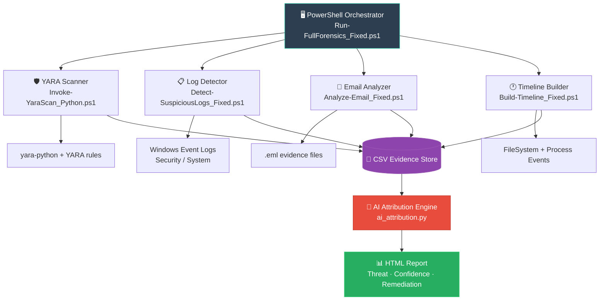

<!-- ═══════════════════════════════════════════════════════════════ -->
<!--                    ANIMATED HEADER  (slice — bold & sharp)    -->
<!-- ═══════════════════════════════════════════════════════════════ -->
<p align="center">
  
</p>

<!-- ══════════════════ ANIMATED TYPING LINE ══════════════════════ -->
<p align="center">
  
</p>

<!-- ═══════════════════════ BADGE ROW ════════════════════════════ -->
<p align="center">
  <a href="https://github.com/LuthandoCandlovu/forensics-platform/stargazers">
    
  </a>
  <a href="https://github.com/LuthandoCandlovu/forensics-platform/network/members">
    
  </a>
  
  
  
  
  
  
</p>

<!-- ═══════════════════ SNAKE / ACTIVITY ANIMATION ═══════════════ -->
<p align="center">
  
</p>

<br/>

---

## 🖼️ Platform Preview

<!-- ─────────────────────────────────────────────────────────────── -->
<!--  YOUR IMAGE — save the screenshot as images/preview.png        -->
<!--  in your repo, then the img tag below will display it.         -->
<!--  How to add it:                                                 -->
<!--    1. mkdir images  (in your repo root)                        -->
<!--    2. Save/download your screenshot as  images/preview.png     -->
<!--    3. git add images/preview.png && git commit && git push      -->
<!-- ─────────────────────────────────────────────────────────────── -->

<p align="center">
  <a href="https://github.com/LuthandoCandlovu/forensics-platform">
    
  </a>
  <br/>
  <sub>
    📌 <em>Platform preview — AI-generated forensic HTML report dashboard.</em><br/>
    <strong>To activate:</strong> save your screenshot as <code>images/preview.png</code> and push it to your repo.
  </sub>
</p>

> 💡 **How to add your image permanently:**
> ```powershell
> mkdir images
> # Copy your screenshot into the images/ folder, name it preview.png
> git add images/preview.png
> git commit -m "Add platform preview screenshot"
> git push
> ```

---

## 🧬 Abstract

> **Digital forensics** is the frontline of modern cybersecurity — yet most investigations are still slow, manual, and error-prone.
> The **AI-Powered Digital Forensics Platform** changes that.

This platform is an end-to-end, **automated incident response toolkit** that fuses classical forensic collection techniques with a **machine learning attribution engine**. It orchestrates YARA-based malware scanning, Windows Event Log anomaly detection, email phishing analysis, and filesystem timeline reconstruction — then feeds all evidence into a **RandomForest ML model** that classifies threats, outputs a confidence score, and generates a human-readable HTML report with actionable remediation steps.

Whether you're a **security analyst**, a **blue-team defender**, or a **student learning DFIR**, this platform gives you a production-grade investigation pipeline in a single command.

<p align="center">
  
  <br/>
  <em>⚡ Automated forensic investigation — from raw evidence to AI report in seconds</em>
</p>

---

## 🌐 Background

The volume and complexity of cyber threats are growing at an unprecedented rate. Traditional manual forensic workflows cannot keep up with:

- 🔺 **Ransomware** campaigns encrypting thousands of files per second
- 🔺 **Phishing emails** that bypass conventional spam filters
- 🔺 **Living-off-the-land** attacks exploiting legitimate system tools
- 🔺 **Log noise** that buries critical indicators of compromise

This project was built to address these challenges head-on using a **modular, AI-assisted approach**:

| Challenge | Our Solution |
|-----------|-------------|
| Slow manual malware triage | ⚡ YARA rule scanning via `yara-python` |
| Missed Windows security events | 📋 Automated `4625` / `7045` event detection |
| Email phishing analysis delay | 📧 Parsed `.eml` headers, links & attachments |
| No unified timeline | 🕐 Filesystem + process event correlation |
| Human-error in threat attribution | 🧠 RandomForest ML with confidence scoring |

---

## ✨ Features

<p align="center">
  
</p>

| Module | Description | Output |
|---|---|---|
| 🛡️ **Malware Scanner** | Recursive YARA-rule file scanning across all directories | `yara_scan_results.csv` |
| 📋 **Log Detector** | Flags failed logins (`4625`) & suspicious new services (`7045`) | `suspicious_logs.csv` |
| 📧 **Email Analyzer** | Parses headers, embedded links & attachments from `.eml` files | `phishing_report.csv` |
| 🕐 **Timeline Builder** | Reconstructs filesystem + process events from the last 7 days | `forensic_timeline.csv` |
| 🧠 **AI Attributor** | ML threat classification with confidence score & remediation steps | `AI_Report.html` |

---

## 📐 System Architecture



---

## 🚀 Quick Start

<p align="center">
  
</p>

### 1️⃣ Clone & Install Dependencies

```powershell
git clone https://github.com/LuthandoCandlovu/forensics-platform.git
cd forensics-platform

# Installs yara-python, pandas, scikit-learn automatically
.\setup_forensics_fixed.ps1
```

### 2️⃣ Add Your Evidence

```
forensics-platform/
├── suspicious_samples/   ← Drop malware samples here
└── emails/               ← Drop .eml email files here
```

### 3️⃣ Run Full Analysis

```powershell
.\Run-FullForensics_Fixed.ps1
```

### 4️⃣ View the AI Report

```powershell
# AI_Report.html opens automatically in your browser 🌐

Threat:          Ransomware
Confidence:      87%
Recommendations: Isolate host · Collect memory dump · Reset credentials
```

---

## 🧠 AI Attribution Engine

<p align="center">
  
</p>

The current model uses a **RandomForest classifier** trained on synthetic samples to demonstrate the pipeline. Replace `ai_attribution.py` with a production-grade model trained on real threat intelligence feeds.

**Planned upgrades:**
- 🔬 XGBoost / LightGBM on real APT datasets (MITRE ATT&CK)
- 🌐 FastAPI backend with live threat feed integration
- 📊 React dashboard with drill-down evidence viewer

**Sample AI Report output:**

```json
{
  "threat_type": "Ransomware",
  "confidence": 0.87,
  "iocs_matched": 14,
  "recommendations": [
    "Isolate affected host immediately",
    "Collect full memory dump (Volatility3)",
    "Reset all user credentials",
    "Notify incident response team"
  ]
}
```

---

## 📁 Project Structure

```
forensics-platform/
│
├── 📜 Run-FullForensics_Fixed.ps1       # Main orchestrator
├── 📜 Invoke-YaraScan_Python.ps1        # YARA malware scanner
├── 📜 Detect-SuspiciousLogs_Fixed.ps1   # Windows Event Log detector
├── 📜 Analyze-Email_Fixed.ps1           # Phishing email analyzer
├── 📜 Build-Timeline_Fixed.ps1          # Forensic timeline builder
├── 🐍 ai_attribution.py                 # ML attribution engine
├── ⚙️  setup_forensics_fixed.ps1        # Dependency installer
│
├── 📂 images/                           # Screenshots & preview images
│   └── 🖼️  preview.png                  # ← your platform screenshot here
├── 📂 suspicious_samples/               # (user-added) malware samples
├── 📂 emails/                           # (user-added) .eml files
│
├── 📊 *.csv                             # Generated evidence (gitignored)
├── 🌐 AI_Report.html                    # Generated AI report (gitignored)
│
├── 📄 README.md
└── 🚫 .gitignore
```

---

## 🛠️ Requirements

| Requirement | Details |
|---|---|
| 🪟 Windows OS | 10 / 11 / Server 2016+ |
| 💙 PowerShell | 5.1 or 7+ |
| 🐍 Python | 3.8+ with pip |
| 🌐 Internet | First-time dependency install only |

---

## 🗺️ Roadmap

<p align="center">
  
</p>

- [x] 🛡️ YARA malware scanning module
- [x] 📋 Windows Event Log detection
- [x] 📧 Email phishing analyzer
- [x] 🕐 Forensic timeline builder
- [x] 🧠 AI attribution with HTML report
- [ ] 🧩 Volatility3 memory forensics integration
- [ ] 📈 Real ML model (XGBoost on MITRE ATT&CK datasets)
- [ ] 🌐 FastAPI backend REST API
- [ ] ⚛️ React dashboard with live evidence viewer
- [ ] 🐳 Docker container for cross-platform support

---

## 🤝 Contributing

Contributions, issues and feature requests are welcome!

1. Fork the repository
2. Create your feature branch: `git checkout -b feature/AmazingFeature`
3. Commit your changes: `git commit -m 'Add AmazingFeature'`
4. Push to the branch: `git push origin feature/AmazingFeature`
5. Open a Pull Request 🎉

---

## ⚠️ Disclaimer

> This tool is intended **strictly for authorized security testing and educational purposes**.
> Only use on systems you **own** or have **explicit written authorization** to test.
> The author accepts no responsibility for misuse, damage, or legal consequences arising from unauthorized use.

---

## 📄 License

Distributed under the **MIT License**. See [`LICENSE`](LICENSE) for more information.

---

## 👨‍💻 Author

<p align="center">
  <b>Luthando Candlovu</b><br/><br/>
  <a href="https://github.com/LuthandoCandlovu">
    
  </a>
  &nbsp;
  
  &nbsp;
  
</p>

---

<!-- ══════════════════ ANIMATED FOOTER ════════════════════════════ -->
<p align="center">
  
</p>

<p align="center">
  
</p>
